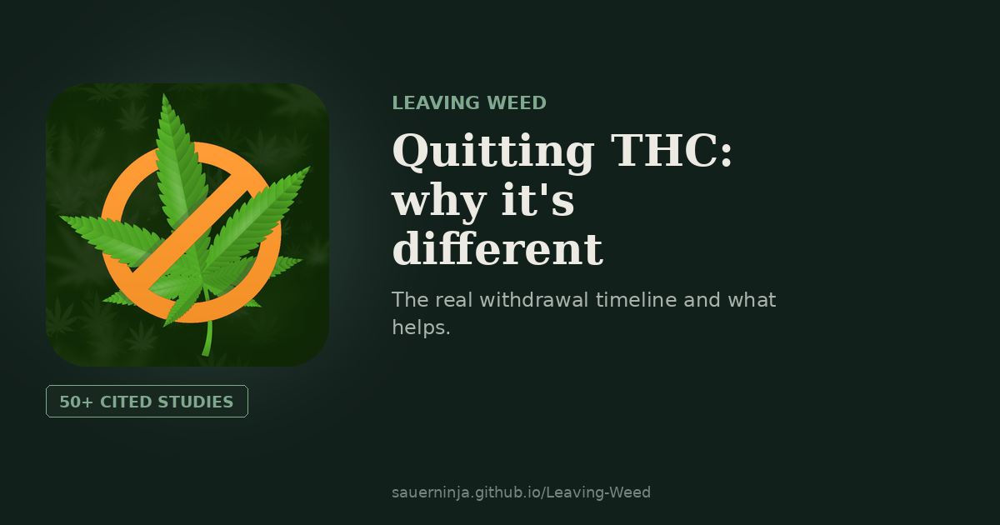

# Leaving Weed — a sourced guide to quitting THC

**Live: [sauerninja.github.io/Leaving-Weed](https://sauerninja.github.io/Leaving-Weed/)**

A free, public, sourced guide to quitting cannabis — the real withdrawal
timeline, why it hits some conditions and situations harder than others,
evidence-based treatment, and how to recover from a single lapse without
losing progress. Free to read, no diagnosis, no shame — just cited clinical
literature, written in plain language.

## What's covered

- Withdrawal timeline, sleep, night sweats, brain fog, post-acute withdrawal (PAWS)
- Tapering vs. cold turkey, quitting alongside nicotine
- Why self-medication happens, and why it hits ADHD, autism, depression, and
  schizotypal traits harder
- The measurable costs of heavy long-term use, cannabinoid hyperemesis
  syndrome (CHS), and why today's cannabis isn't the same drug as decades ago
- The real history behind Reefer Madness — the propaganda, the racism, and
  the one narrow thing it accidentally wasn't entirely wrong about
- Paranoia and psychosis — treated as real risks, not romanticized
- Evidence-based treatment (CBT, contingency management), free peer support
  (Marijuana Anonymous, SMART Recovery)
- THC detection windows, physical recovery, benefits-of-quitting timeline
- A single slip vs. relapse, real-life situations (parenting, social circles,
  substitution risk), and how this affects relationships

Every claim is attributed inline with a full, checkable reference list at
the bottom of the page. Share a link straight to any section — each one has
its own anchor, e.g. `index.html#treatment`.

## Why this exists

A public, sourced resource for anyone dealing with heavy cannabis use and
trying to quit — grounded in real clinical literature instead of guesswork,
shame, or vague advice.

## Files

| File | What it is |
|---|---|
| `index.html` | **The main page.** Everything above — this is what's meant to rank in search and get shared. |
| `journal.html` | An optional day-by-day journal template anyone can use to track their own quit. Not indexed by search engines — it's a tool, not a record of any one person. |
| `404.html` | Branded not-found page with a way back to the guide. |
| `LICENSE` | MIT license. |
| `robots.txt` / `sitemap.xml` | Search engine crawling and indexing config. |
| `.nojekyll` | Empty file telling GitHub Pages to skip its default Jekyll build. |
| `favicon.ico`, `favicon-16.png`, `favicon-32.png`, `apple-touch-icon.png`, `icon-512.png`, `og-image.png` | Site icon and social share image. |
| `yandex_b5a6a56713970142.html` | One-time Yandex Webmaster site-ownership verification file. Safe to leave in place permanently. |

## License

MIT — see `LICENSE`. Use, adapt, and redistribute freely, with attribution
appreciated but not required.

## If you're reading this because it applies to you

A website can explain mechanisms. It can't replace a doctor, a therapist, or
a crisis line.

- **Looking for treatment?** SAMHSA's National Helpline — 1-800-662-4357 —
  free, confidential, 24/7. Or search [findtreatment.gov](https://findtreatment.gov).
- **In crisis right now?** Call or text **988** (Suicide & Crisis Lifeline, US).

You don't need a clean explanation of what's happening to ask for help.
